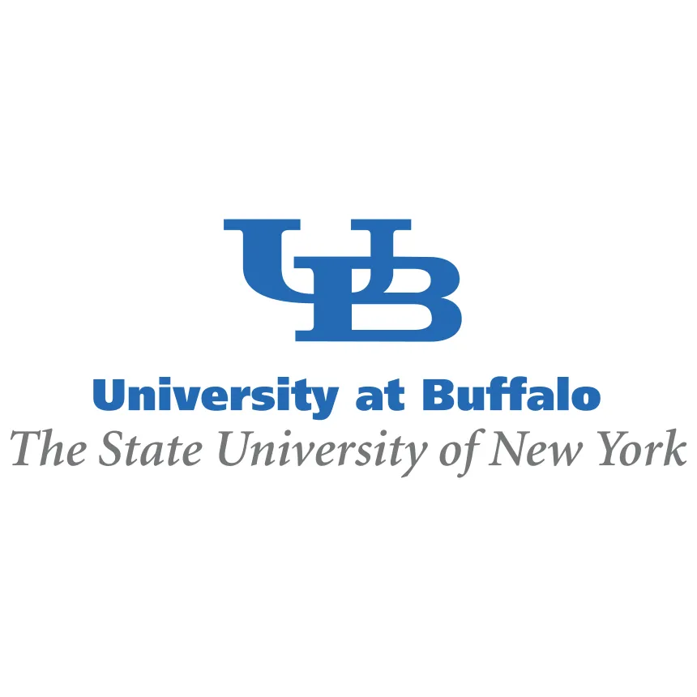

# 👋 Hi there, I'm Dakshesh Gusain

<!-- Resume, LeetCode, and Website Links -->

  📄 <a href="./dgusain_rbi_resume.pdf">Resume</a> | 🐱‍💻 <a href="https://leetcode.com/u/dgusain_31/">LeetCode</a> | 🌐 <a href="https://github.com/dgusain">GitHub</a> | 🌐 <a href="https://linkedin.com/in/dgusain04">LinkedIn</a>

<!-- Dynamic Typing SVG for Welcome Message -->
<!-- Centered Typing SVG -->

  

<!-- Intro Section -->
- 👋 **Greetings fellow AI and Robotics enthusiasts!** I'm **Dakshesh Gusain**, an AI researcher with hands-on experience in developing multimodal Large Language Models (LLMs) and robotics for healthcare applications, such as speech-language therapy and American Sign Language (ASL) communication.
  
- **🌱 Learning:** I specialize in **LLM Quantization** and **Reinforcement Learning**, focusing on AI applications in socially assistive robotics. Proficient in **CUDA**, **distributed computing**, and **real-time AI integration**, with a passion for improving patient care and communication for vulnerable populations.
  
- **🔭 Current Work:** I am actively engaged in several interdisciplinary research projects:
  - **MISTY 2 Speech-Language Therapy Robot**: Fine-tuning multimodal LLMs, including **TinyLLama**, to enable real-time speech therapy for children using social robots with minimal latency.  
  - **Sign-Mimic Robotic Hand**: Developing a robotic hand simulator in **MuJoCo** for ASL communication using reinforcement learning and pose estimation models.
    
- **👨‍💼 Experience:** I have worked as a Research Assistant at the **Center for Unified Biometrics and Sensors (CUBS)** and the **SUNY Research Foundation** at the **University at Buffalo**, developing LLMs and AI-driven systems for healthcare applications. Additionally, I led the creation of a **low-cost autonomous biomedical device** for a 20-member biomedical research team across three universities (patent pending).

- **👯 Looking to Collaborate On:** AI in robotics, **LLM based applications**, **Computer vision**, and **multi-modal AI**.

- ⚡ **Highlight:** I engineered a cutting-edge, autonomous biomedical device under $300 for a 20-member biomedical research team collaborating across three universities. Remarkably, this device delivers performance equivalent to $45,000 industry-standard equipment, boosting our team's operational efficiency by 200% and cutting experimental time by 66%. [Explore the project here](https://github.com/dgusain/MIST).

  
- **📫 How to Reach Me:** [dgusain@buffalo.edu](mailto:dgusain@buffalo.edu)

## 🛠️ Languages and Tools

### Programming Languages and Frameworks:
<code></code>
<code></code>
<code></code>
<code></code>
<code></code>
<code></code>
<code></code>

### Machine Learning & Data Science:
<code></code>
<code></code>
<code></code>
<code></code>

<!-- Visitor Count -->

<!-- GitHub Stats -->
## 🐙 GitHub Stats

<!-- GitHub Streak Stats -->
## What am I up to? 🤔

<!-- Top Languages Card -->

<!-- GitHub Activity Graph --> 
 

<!-- Footer Image or Animation -->

  

---

## 🚀 Projects

<table>
<tr>
  <td width="75%">
  
  ### [Sign-Mimic: Robotic Hand Simulator for ASL](https://github.com/dgusain/SignMimic)  
  *July 2024 - Present      

  - **Project:** Robotic hand simulation model in **MuJoCo** for ASL communication using reinforcement learning.
  - **Technologies:** **SMPLX**, **Hands4Whole**, **Reinforced Imitation Learning**.
  - **Achievements:** Developed an architecture capable of mapping ASL poses to a 24-joint robotic hand simulation.
  
  </td>
  <td width="25%">
    
  </td>
</tr>
</table>

<table>
<tr>
  <td width="75%">

  ### [Deal-no-deal: LLM Empowered Stock Market Predictor](https://github.com/dgusain/Deal-no-deal)  
  *July 2024 ‑ August 2024*      

  - **Deployment:** LLM-driven system using **RAG architecture** and **FAISS** to assess the impact of news on stock prices.
  - **Technologies:** **LLaMA-3 (8B, 70B)**, **Facebook FAISS**, **RAG**.
  - **Achievements:** Integrated sentiment analysis with news credibility for accurate market predictions.

  </td>
  <td width="25%">
    
  </td>
</tr>
</table>

## 🎓 Education

 **University at Buffalo, The State University of New York**  (*August 2023 – December 2024*)
| *Master of Science in Artificial Intelligence*      |  **GPA**: 3.45 / 4.0          |
| :-------------------------------------------------- | ----------------------------: |

 **Amrita Vishwa Vidyapeetham**  (*July 2019 – June 2023*)
| *Bachelor of Technology in Aerospace Engineering*  |   **GPA**: 3.89 / 4.0         |
| :-------------------------------------------------- | ----------------------------: |

---

**Relevant Courses**:  
Machine Learning, Pattern Recognition, Computer Vision & Image Processing, Reinforcement Learning, Deep Learning, Advanced Algorithm Analysis & Data Structures, Data Intensive Computing, Information Retrieval, Numerical Math.

## 🛠️ Skills

- **Programming:** Python, PySpark, SQL, Java, Shell Scripting, HTML, LaTeX, Apache Solr, C++.
- **Machine Learning:** Transformers,  Parameter-Efficient Training, LoRA, Predictive Analytics, Feature Engineering, Clustering, Advanced Statistics, Reinforcement learning, Imitation learning, Large Language Models - Training, Fine-tuning, Quantization
- **Frameworks/Libraries:** PyTorch, TensorFlow, Hugging Face, Ollama, OpenGL, OpenCL, MMEngine, SMPLX, OSX, MuJoCo, CuDNN, ONNX Runtime, TensorRT, Hadoop, scikit-learn, Pandas, statsmodels, NumPy, OpenMMLab, CUDA, spaCy, NLTK, Raspberry Pi, Arduino, StableBaseline3. 
- **Information Technology:** Linux, Cloud Computing, Distributed Computing, Big Data, OpenShift, Git, Postman, GCP.

<!---
dgusain/dgusain is a ✨ special ✨ repository because its `README.md` (this file) appears on your GitHub profile.
You can click the Preview link to take a look at your changes.
--->
